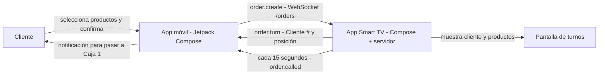

# Diagrama de contexto

```mermaid
flowchart LR
    C[Cliente] -->|selecciona productos y confirma| M[App móvil - Jetpack Compose]
    M -->|order.create - WebSocket /orders| T[App Smart TV - Compose + servidor]
    T -->|order.turn - Cliente # y posición| M
    T -->|muestra cliente y productos| P[Pantalla de turnos]
    T -->|cada 15 segundos - order.called| M
    M -->|notificación para pasar a Caja 1| C
```

La lógica y los modelos del intercambio se concentran en el módulo `shared`, utilizado por las dos aplicaciones para evitar contratos duplicados.
